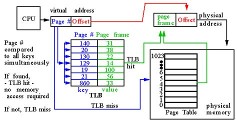
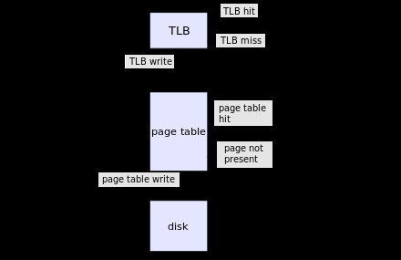

## OS06_02

### Process's modules addresses.

1. set breakpoint.
2. start debug mode.
3. open module window. `Debug -> Windows -> Modules` `(Ctr + Alt + U)`.
---
### Set fixed address for process modules.

1. open **project** properties. 
2. go to `Linker -> Advanced`.
3. set `Randomized Base Address` to NO.
4. set `Fixed Base Address` to YES.
5. (OPTIONAL) set `Base Address` to address you want.

## OS06_03

### Find element in memory using calculated offset.

1. set breakpoint after index initialization and before calling `VirtualFree` function.
2. start debug (`F5`).
3. open `Memory 1` window. `Debug -> Windows -> Memory -> Memory 1` (`Alt + 6`).
4. enter `virtArray + index` to address input.

---
### ANSWERS

#### Поясните понятие «виртуальная память».

Метод управления памятью,
позволяющий выделить процессам адресные
пространства, суммарный объем которых превышает
физический объем оперативной памяти компьютера.

---
#### Поясните понятие «свопинг».

Аппаратно-программный механиз OS, для обмена (вытеснения и
загрузки) содержимым блоков оперативной физической
памяти компьютера с устройством хранения данных с
целью расширения адресуемого объема оперативной памяти
компьютера.

---
#### Поясните понятие «страничная память».

Реализации виртуальной памяти,
при которой физическая память и адресное пространство
разбивается на блоки (страницы), а также осуществляется
страничный свопинг

---
#### Поясните понятие MMU.

MMU (Memory Management Unit) – диспетчер памяти, 
программируемое аппаратное устройство, входящее в
состав процессора и предназначенное для трансляции
виртуальных адресов оперативной памяти в реальные.

---
#### Поясните понятие TLB.


### Увага

TLB (Translation Lookaside Buffer) – буфер быстрого
преобразования адреса – ассоциативная память
(параллельный поиск)

Механизм позволяющий уменьшить время доступа к памяти. Он хранит пары ключ (тэг) значение (адресс памяти)




---
#### Какая информация содержится в строке таблицы страниц


---
#### Поясните принцип применения хэш-таблиц.

#### Поясните применение «инвертированной таблицы физических» страничной памяти.
#### Поясните понятие «рабочий набор страниц».

набор страниц процесса, минимизирующий замещений страниц;
если известен рабочий набор страниц можно осуществить их опережающую подкачку;
основан на статистическом поведении процесса.

Рабочий набор процесса — это набор страниц в виртуальном адресном пространстве процесса, который в настоящее время находится в физической памяти. [источник](https://learn.microsoft.com/ru-ru/windows/win32/memory/working-set)

---
#### Поясните принцип работы алгоритма LRU.

- У каждого элемента есть счетчик использований.
- Каждый раз когда этот элемент используется счетчик увеличивается.
- При необходимости замещения, замещается элемент с наименьшим значением счетчика. 

---
#### Windows: поясните назначение сервиса SysMain.

SysMain – сервис предварительной подкачки.

---
#### Windows: поясните назначение файла hiberfil.sys.

Файл для сохранения памяти в режиме гибернации.

---
#### Windows: поясните назначение файла pagefile.sys.

Файл подкачки.

---
#### Windows: поясните назначение файла swapfile.sys.

Файл подкачки отдельных (предварительно скаченных из магазина приложений) для быстрого
применения

---
#### Windows: перечислите области адресного пространства (от младших к старшим адресам) и поясните их назначения.

- stack
- heap
- program image
- dll
- tebs
- peb

---
#### Windows: какой стандартный начальный размер области heap?

1MB

---
#### Windows: каким образом можно изменить начальный размер области памяти heap приложения?

С помощью параметра компоновщика `/HEAP:"<size>"`.

---
#### Windows: какой стандартный размер области памяти stack?

1MB

---
#### Windows: каким образом можно изменить размер области памяти stack приложения?

С помощью параметра компоновщика `/STACK:"<size>"`.

---
#### Windows: поясните назначение функции Windows API: GlobalMemoryStatus.

Получение информации о использовании физической и виртуальной памяти.

---
#### Windows: поясните назначение функции Windows API: VirtualQuery; перечислите значения атрибутов Protect, State и Type.

Получение информации о страницах виртуального адресного пространства.

```c++
SIZE_T VirtualQuery(
  [in, optional] LPCVOID                   lpAddress,
  [out]          PMEMORY_BASIC_INFORMATION lpBuffer,
  [in]           SIZE_T                    dwLength
);
```

- State
    - MEM_COMMIT
    - MEM_FREE
    - MEM_RESERVE
    - MEM_RESET (нет на [MSDN](https://learn.microsoft.com/en-us/windows/win32/api/winnt/ns-winnt-memory_basic_information))
- Type 
    - MEM_IMAGE
    - MEM_MAPPED
    - MEM_PRIVATE
- Protect
    - PAGE_READONLY
    - PAGE_READWRITE
    - PAGE_EXECUTE
    - PAGE_EXECUTE_READWRITE
    - PAGE_NOACCESS
    - PAGE_NOCACHE

---
#### Windows: что такое «рабочее множество»? поясните принцип управления рабочим множеством с помощью OS API.

- количество памяти, требующееся процессу в заданный интервал времени.

[Реализация](https://ru.wikipedia.org/wiki/%D0%A0%D0%B0%D0%B1%D0%BE%D1%87%D0%B5%D0%B5_%D0%BC%D0%BD%D0%BE%D0%B6%D0%B5%D1%81%D1%82%D0%B2%D0%BE#%D0%A0%D0%B5%D0%B0%D0%BB%D0%B8%D0%B7%D0%B0%D1%86%D0%B8%D1%8F)

---
#### Windows: что означает «страница заблокирована»? с помощью каких функций OS API можно установить блокировку страниц и снять блокировку? Какое максимальное количество страниц можно заблокировать?

Значит что эта страница не может быть записана в своп.

- Установить блокировку страниц.

```c++
BOOL VirtualLock(
  [in] LPVOID lpAddress, // pointer to the base address of the region of pages to be locked
  [in] SIZE_T dwSize // the size of the region to be locked, in bytes
);
```

- Снять блокировку.

```c++
BOOL VirtualUnlock(
  [in] LPVOID lpAddress, // pointer to the base address of the region of pages to be locked
  [in] SIZE_T dwSize // the size of the region to be locked, in bytes
);
```

- Максимально 30 заблокированных страниц

---
#### Windows: что такое «heap»? Что такое «heap процесса»? Что такое «пользовательская heap»? Поясните принцип устройства heap.

- heap - область памяти, предназначенная для записи данных с неизвестной изначальной длинной.
- пользовательская heap - heap созданный не ОС, а программистом.

##### Принцип

При запуске процесса ОС выделяет память для размещения кучи. В дальнейшем память для кучи (под кучу) может выделяться динамически. Программа пользователя, используя функции, подобные malloc(), может получать указатели на области памяти, принадлежащие куче. Программы используют кучу для размещения динамически создаваемых структур данных. Программа может освободить память с помощью функций, подобных free(). 

[источник](https://ru.wikipedia.org/wiki/%D0%9A%D1%83%D1%87%D0%B0_(%D0%BF%D0%B0%D0%BC%D1%8F%D1%82%D1%8C))

---
#### Linux: перечислите области адресного пространства (от младших к старшим адресам) и поясните их назначения.

- Kernal Space 
- User Space 
    - code 
    - data 
        - global variables - инициализированные глобальные переменные
        - bss - глобальные переменные без инициализации
        - heap - динимически выделяемая под объекты пямять
        - stack - 

---
#### Linux: в какой части адресного пространства выделяется памяти с помощью функций malloc, calloc?

heap

